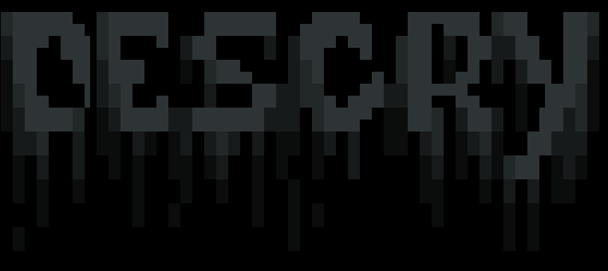

  

      DIScry v1.0(beta)

## DISCLAIMER

  TO BE USED FOR EDUCATIONAL PURPOSES ONLY

 **COMPLETE
RESPONSIBILITY of the END-USER**. Developers assume NO liability and are NOT
responsible for any misuse or damage caused by this program. Also we inform you
that some of your your actions may be **ILLEGAL** and you **CAN NOT** use this
software to test person or company without **WRITTEN PERMISSION** from them.

# DEVELOPERS & CONTRIBUTORS

1. HADES (https://github.com/hades-onion)

# SCREENSHOT (Android-Termux)

### TESTED :-
(server)
- Linux
- Windows
- Android
- IOS
- OSX
### TESTED :-
(Backdoor)
- Linux
- Windows
- Android
- OSX

### PREREQUISITES ( Please verify if you have installed )

- Python 3.\*
- termcolor (pip install termcolor)
